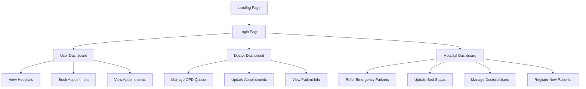

# 🏥 Hospital Integration System

**Centralized coordination across hospitals for emergencies, appointments, and real-time healthcare data.**

---

## 🌟 Overview

The **Hospital Integration System** is designed to unify all hospitals within a city or region under one digital platform. It empowers hospitals, doctors, patients, and government agencies to collaborate more effectively — especially crucial during healthcare emergencies such as the COVID-19 pandemic.

With real-time visibility into hospital resources, referrals, and appointments, the system improves patient outcomes and reduces administrative friction.

---

## 🔑 Key Features

### 👥 User Dashboard

* View all registered hospitals across the city
* Search doctors by specialization
* Book/view appointments with preferred doctors

### 👨‍⚕️ Doctor Dashboard

* Manage OPD queues
* View and update appointment statuses
* Patient list access and schedule overview

### 🏨 Hospital Dashboard

* Refer emergency cases to other hospitals
* Update bed and ICU availability
* Manage doctors, patients, and appointments
* Register new patients and handle internal data

---

## 🧠 Tech Stack

| Layer       | Technology                                             |
| ----------- | ------------------------------------------------------ |
| Backend     | Java, Spring Boot                                      |
| Frontend    | HTML, CSS, JavaScript                                  |
| Database    | MySQL, SQL                                             |
| Tables Used | `users`, `patients`, `doctors`, `appointments`, `beds` |

---

## 🔄 System Flow



---

## 🛠️ Project Structure

```
Hospital-Integration_System/
├── backend/                  # Spring Boot backend (controllers, services, entities)
├── frontend/                 # HTML, CSS, JS static frontend
├── sql/                      # SQL schema and seed data
├── docs/                     # Documentation, diagrams, planning
└── README.md                 # This file
```

---

## 🚀 Getting Started

### ✅ Prerequisites

* Java 11+ and Spring Boot
* MySQL server running
* Maven
* IDE (IntelliJ, Eclipse)

### 📂 Database Setup

Create database and tables using the provided SQL schema:

```sql
CREATE DATABASE hospital_system;

USE hospital_system;

-- Example table
CREATE TABLE users (
  id INT PRIMARY KEY AUTO_INCREMENT,
  username VARCHAR(50),
  password VARCHAR(100),
  role ENUM('user', 'doctor', 'hospital')
);
-- Repeat for patients, doctors, appointments, beds
```

### 🔧 Installation

```bash
# Clone the repository
git clone https://github.com/Harshalthedev/Hospital-Intgeration_System.git
cd Hospital-Intgeration_System

# Open in your IDE and run the Spring Boot Application
# Backend runs on: http://localhost:8080/
```

### 🌐 Access Frontend

Open the frontend HTML files in your browser (or serve them via Spring Boot or any static server).

---

## 📈 Future Enhancements

* API integration with ambulance dispatch
* Mobile app support for patients
* Role-based login with JWT auth
* Patient history and prescriptions tracking
* Push/SMS alerts for appointment and emergency updates

---

## 🤝 Contributing

1. Fork this repository
2. Create a new branch: `feature/your-feature-name`
3. Commit your changes
4. Open a pull request

We welcome bug fixes, feature suggestions, or even UI enhancements.

---

## 📄 License

This project is licensed under the [MIT License](LICENSE).

---

## 👨‍💻 Author

**Harshal**
GitHub: [@Harshalthedev](https://github.com/Harshalthedev)
Project created with purpose and vision during public health crisis response.

---
